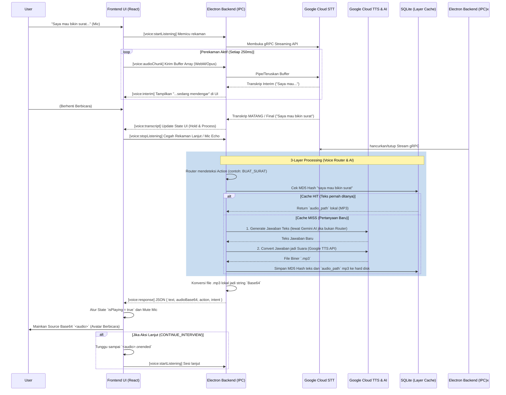

# Panduan Arsitektur Voice Assistant (Nagari AI)

Dokumen ini ditujukan bagi tim pengembang (developer) untuk memahami secara mendalam arsitektur, alur data, dan interaksi komponen di balik fitur Voice Assistant pada aplikasi Nagari AI.

---

## 1. Ikhtisar Sistem (System Overview)
Sistem Voice Assistant ini menjembatani interaksi suara antara pengguna dan sistem Kiosk/Aplikasi Desktop (berbasis Electron). Proses pengenalan suara (Speech-to-Text/STT) dikirim dari antarmuka React secara real-time ke main process Electron, lalu diteruskan ke Google Cloud STT. Teks yang diperoleh kemudian diolah menggunakan *State Machine Router*, di-cache menggunakan SQLite, atau ditanyakan ke AI Generatif (Gemini), sebelum akhirnya dijawab kembali dalam bentuk suara oleh Text-to-Speech (Google Cloud TTS).

## 2. Komponen Utama

Arsitektur dibagi menjadi Lingkungan Frontend (Chromium/React) dan Backend (Node.js/Electron Main Process):

### A. Frontend (UI / React)
1. **`src/ui/ui/components/GlobalVoiceWidget.js`**: Widget global yang menempel di layar aplikasi. 
   - **Tugas**: Meminta izin mikrofon (`getUserMedia`), merekam suara (`MediaRecorder` dengan format `webm/opus`), mengontrol state UI (`isRecording`, `isPlaying`, `isSessionActive`), dan memainkan suaranya (via elemen `<audio>`).
   - **Komunikasi**: Mengirim/dikirim data ke backend melalui modul `ipcRenderer`.

### B. Backend (Electron Main Process / Node.js)
1. **Controller (`voiceController.js` & `main.js`)**:
   - Menghubungkan jalur (channels) komunikasi IPC (Inter-Process Communication) dari Frontend ke Backend.
2. **Service Layer (`src/app/services/voiceService.js`)**:
   - Otak utama aliran data teks. Tempat berjalannya logika *3-Layer Fallback*:
     1. **`VoiceRouter`**: Rule-based routing untuk mendeteksi intent khusus (seperti pindah halaman, bikin surat, dsb).
     2. **Cache (MD5 DB)**: Mengecek apabila teks pernah ditanyakan sebelumnya.
     3. **AI Fallback**: Mengirim teks ke AI Generatif (`aiService.js`).
3. **Speech-to-Text (`src/infrastructure/speech/sttService.js`)**:
   - Menerima chunk/potongan audio dan mengirimnya via gRPC Steam ke Google Cloud Speech (`streamingRecognize`).
4. **Text-to-Speech (`src/infrastructure/tts/ttsService.js`)**:
   - Menjadikan respon string Node menjadi file MP3 melalui koneksi Google Cloud TTS API.
5. **Storage / Repository (`src/app/repositories/voiceRepository.js`)**:
   - Penyimpanan lokal SQLite (`voice_cache`). Bertugas me-*record* `question_hash` (MD5 teks) dan `audio_path` (lokasi hard disk tempat TTS mp3 disimpan) agar pembacaan ulang jauh lebih cepat dan tidak memakan kuota cloud.

---

## 3. Alur Data Utama (Data Flow)

Berikut adalah siklus satu interaksi penuh sejak pengguna mulai berbicara hingga Avatar membalas. Untuk kemudahan visualisasi tim, silakan amati *Sequence Diagram* di bawah ini:

### Penjelasan Alur (Langkah demi Langkah):
1. **Start Listening**: User menekan tombol di `GlobalVoiceWidget`. UI mengirim event `voice:startListening`. Backend memicu Google STT Stream.
2. **Streaming Audio Chunk**: Setiap 250ms, `<MediaRecorder>` memotong audio dari mic, menjadikannya `ArrayBuffer`, lalu menembakkan lewat IPC (`voice:audioChunk`).
3. **STT Transcribe**: Backend menerima chunk dan memasukkannya me-*"pipe"* ke Google Cloud. Jika mendapatkan hasil sementara (interim), ia membalas frontend (event `voice:interim`). Jika kalimat selesai, Google mengirim final mark dan IPC mengirim (event `voice:transcript`).
4. **Processing Layer**: Frontend menerima `voice:transcript` dan mematikan record UI. Backend (`voiceService`) serentak mulai mengolah teks:
   - Apabila teks = "Saya mau bikin surat", router menangkap Intent. 
   - Backend melihat apakah hash MD5 frase ini ada di Cache SQLite. 
     - Jika (Ya): Ambil direktori lokal Mp3 (Cache Hit).
     - Jika (Tidak): Tanya AI/ambil balasan router, lalu generasikan MP3 rekaman Text-to-Speech baru menggunakan Google Cloud dan simpan ke DB.
5. **Audio Transmission**: File audio MP3 hasil dari TTS atau Cache dibaca di backend, diubah menjadi string format `Base64` (agar mudah dikonsumsi IPC Chrome).
6. **Playback**: Backend mengirim event `voice:response` membawa jawaban Teks JSON dan `audioBase64`. Frontend menerima base64, menyuntikkannya ke source `<audio>`, mengatur state UI menjadi *playing*, lalu mulai memutar audio (*play*), yang diikuti oleh lipsync Avatar. Mute mikrofon dipastikan lewat pemanggilan `voice:stopListening` sebelumnya.

---

## 4. Kamus Event IPC (Inter-Process Communication Channels)

- **Frontend ke Backend (Invoke/Send)**:
  - `voice:startListening`: Membangunkan stream Google Cloud STT.
  - `voice:stopListening`: Memaksa memutus stream STT untuk menghindari suara bocor/echo.
  - `voice:audioChunk`: Membawa data mentah (buffer `.webm/.opus`).
  - `voice:synthesize`: Meminta backend melakukan TTS tanpa STT (biasanya untuk text statis/Welcome message).
  
- **Backend ke Frontend (On/Listen)**:
  - `voice:interim`: Transkripsi teks sementara yang belum akurat (untuk rendering titik-titik UI).
  - `voice:transcript`: Teks pengenalan yang sudah matang/final.
  - `voice:response`: Hasil pemrosesan utuh. Berisi properti seperti `{ text, audioBase64, action, intent }`.
  - `voice:error`: Membawa pesan kegagalan (Network error, dsb).

---

## 5. Tantangan Saat Ini & Potensi Utang Teknis (Technical Debts)

Tim developer ke depan harus memperhatikan beberapa titik lemah (bottlenecks) dari arsitektur ini jika ditarik beroperasi secara massal/berat:

1. **Beban IPC yang Cukup Berat**: 
   - Pengiriman *chunk* audio dari React ke Node setiap 250 milidetik *sangat sering* dan memakan CPU cycle yang lumayan untuk serialisasi di jembatan IPC. 
   - Pengiriman *Audio MP3 berdurasi panjang* sebagai format **Base64 string** kembali ke frontend dapat menyebabkan sedikit lag (Frame Drop) di PC spesifikasi rendah, sebelum akhirnya audio tersebut ter-render.
   - **Solusi ke depan**: Gantilah format playback dari Base64 string IPC dengan `File Server` bawaan Node (HTTP Localhost). Jadinya Backend hanya mengembalikan URL seperti `http://localhost:3002/cache/audio1-abc.mp3` dan frontend Chromium yang men-streaming filenya.

2. **Hilangnya Kata Pertama saat STT Reconnect ("Suku Kata Dropping")**:
   - Google Cloud Speech API punya limit time-out natural (misal karena senyap terlalu lama atau lewat limit menit stream). `sttService.js` akan me-reset koneksinya secara dinamis.
   - Di sela detik (gap) stream ini dimatikan dan dihidupkan (*instantiating* objek), jika chunk berdatangan, sistem membuang chunk tersebut secara silent. Akibatnya kata pertama user (cth: "Halo") bisa terpotong menjadi ("..lo").
   - **Solusi ke depan**: Implementasikan array pembendungan memori (*Buffer Queue*) `this.pendingChunks = []` ketika status stream sedang tidak siap (`!this.recognizeStream`). Setelah *ready*, siram (flush) isi buffer ini sekaligus ke stream.

3. **Database Kiosk Bisa Membengkak (No Eviction)**:
   - Cache `voice_cache` menyimpan teks dan me-log lokasi file mp3. Selama kiosk berjalan berbulan-bulan, *file audio* akan menumpuk memakan kapasitas Storage sistem C:\ atau /User directory Anda.
   - **Solusi ke depan**: Buatlah implementasi *Cron Routine* yang membersihkan folder MP3 TTS cache lama secara berkala setiap malam.

prompt 
saya ada proyek yang stuck, saya mau RND, saya ada proyek bernama Anjungan Nagari Mandiri atau ANM, konsep sistem ini adalah berbasis dekstop dengan react electron, dan juga laravel disisi backend dengan midlleware multi tenant, jadi saya mau fokus ke electron dahulu, aku mau sistem ini ai yang mengarahkan user, misalkan user ingin buat surat absen dll, user hanya berbicara saya dengan ai, dan ai mendengarkan secara listening / tidak ada on off button untuk setiap percakapan / standby, jadi mendeteksi dengan kamera, nah disini saya mau si ai yg mengarahkan dan eksekusi endpoin backend saya, misalkan user membuat surat keterangan usaha , maka aia akan mengarahkan masukan nik dengan virtual keyboard dan ai akan memvalidasi hasil nya dengan percakapan, jika semua benar, maka ai akan mengarahkan ke step selanjutnya, misalkan mau buat surat apa, misal surat usaha, maka akan dipastikan tujuan, nama  usaha dan alamatnya, setelah selesai maka ai akan validasi lagi, apa ini sudah benar, jika benar maka kan keluar barcode sebagai resi untuk mencetak surat, kenapa kelaur resi karena harus ditanda tangani , apa anda paham, 

sistem sat ini 

